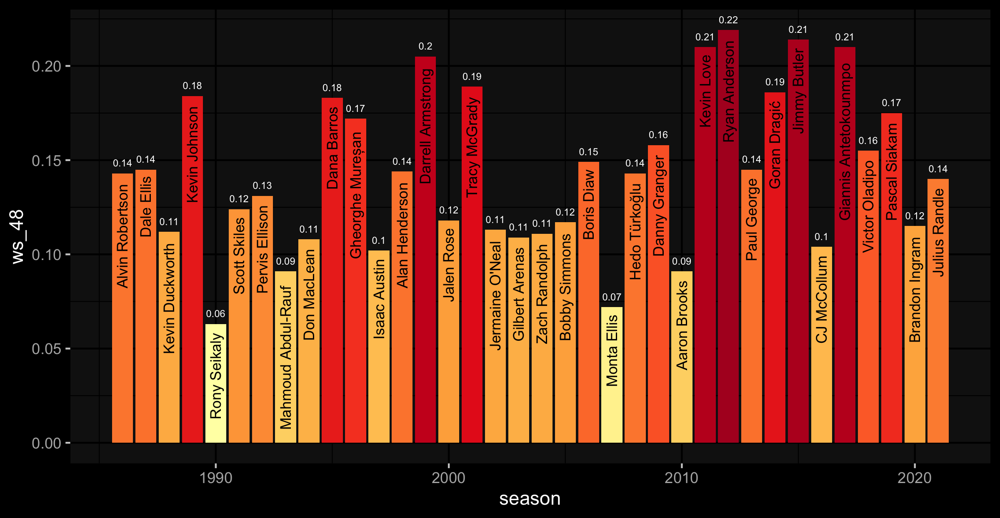

```{r setup, include=FALSE}
knitr::opts_chunk$set(cache = TRUE,
                      echo = TRUE,
                      warning = FALSE,
                      message = FALSE)
```

# Re-Introduction

For my HarvardX capstone project, I performed an analysis on whether I could predict this year's Most Improved Player and next year's candidates (found here). With the 2019-2020 regular season being restarted in Orlando, I decided to go back and improve on it. Major changes include:

* a more robust dataset (instead of using the IMPORTHTML function on Google Sheets multiple times, I learned how to webscrape)
* a new variable (experience or seasons played in the league)
* different machine learning models (a decision tree does not lend itself to use with this many granular decimals)

# Introduction

As the beginning of a new NBA season nears, predictions start to roll in from pundits. In terms of major player awards, the Most Improved Player is the most "predicted by gut feeling".

* there are usually a select group of players that have a chance at Most Valuable Player and Defensive Player of the Year, with minor turnover year-over-year
* Sixth Man of the Year (given to the best performing player that does not start the game on the court) has morphed into a type: the high scoring guard that ironically often places in the top 5 in minutes played on the team
    + a guard has won 13 of the past 15 years, and the winner regardless of position has placed in the top 5 in minutes played on the team 12 of the 15 years
* Rookie of the Year, by definition, has turnover every year, but predictions tend towards players taken near the beginning of the draft

The goal of this analysis is to use machine learning to make a two-fold prediction.

1. Predict the winner of this year's (2021) MIP award.
2. Predict candidates of next year's (2022) MIP award.

On May 25, 2021, Julius Randle was revealed as the 2021 MIP. While disappointed I wasn't able to create a model in time, it'll serve as a good check.

Steps that were performed:

1. loading the data and swapping NA's with 0's
2. visualizing how MIP winners have performed and how much vote share they received
3. create a version of the data that shows statistical jumps (current season minus previous season)
4. separating out evaluation sets (the 2020 season) and test sets (the 1987 season for predicting the 2020 winner, the 1986 and 2019 seasons for predicting 2021 candidates)
5. training five models: a linear baseline, a k-nearest-neighbors model, two separate random forest models and a support vector machine model

Note: to simplify the Season column, I refer to each season by its second half. So you might also hear the current season referred to as the 2020-2021 season.

# Methods/Analysis

## Loading Packages

Let's start by loading required packages.
```{r load_pkgs, results="hide"}
if(!require(tidyverse)) 
  install.packages("tidyverse", repos = "http://cran.us.r-project.org")
if(!require(caret)) 
  install.packages("caret", repos = "http://cran.us.r-project.org")
#Rborist and ranger are random forest algorithm wrappers
if(!require(Rborist)) 
  install.packages("Rborist", repos = "http://cran.us.r-project.org")
if(!require(ranger)) 
  install.packages("ranger", repos = "http://cran.us.r-project.org")
#matrix stats
if(!require(matrixStats)) 
  install.packages("matrixStats", repos = "http://cran.us.r-project.org")
#kableExtra allows more customization of tables
if(!require(kableExtra)) 
  install.packages("kableExtra")
if(!require(RColorBrewer)) 
  install.packages("RColorBrewer", repos = "http://cran.us.r-project.org")
#for dark background plots
if(!require(ggdark)) 
  install.packages("ggdark", repos = "http://cran.us.r-project.org")
```

## Downloading  the Data

This is a dataset that I have compiled from Basketball-Reference. Each player season contains some identifying factors:

* a unique Season ID
* the player's name
* the player's age as of February 1st of that season (per Basketball-Reference recordkeeping)
* the team that the player played for (if they played for multiple teams, it was recorded as TOT)
* the actual season
* the birth year
    + this is to break ties, as there are instances of 2 players having the same name and playing in the same season as well as father and son playing in different eras under the same name
* the number of years of experience the player has accumulated
    + a rookie, or a player with no prior experience, is given the value 1
    + this value is incremented up every subsequent season that a player has played in; if a player is a rookie in the 1990 NBA season, skips the 1991 NBA season and comes back for the 1992 NBA season, his experience value in 1992 is 2, not 3

There are three comma-separated value files of player statistics: 

* Player Per Game contains per game stats
* Per 100 Poss contains stats per 100 possessions
    + this adjusts for pace, which is the number of possessions teams use in 48 minutes (the typical length of a game, excluding overtimes)
    + this is necessary because the late 1990s/early 2000s were notoriously slow, so raw statistics were depressed
* Advanced contains advanced stats
    + for more information, refer to this [*Basketball-Reference glossary*](https://www.basketball-reference.com/about/glossary.html)
    
The above three files will be combined into one dataframe with seasons prior to 1984-1985 (which is one season before the inaugural awarding of the MIP award) removed. For players that played for multiple teams in one season, the partial seasons will be discarded. The shooting percentage columns will by multiplied by 100 to remain consistent with the other percent columns.

```{r load_stats_csvs,results='hide'}
#specify columns because otherwise birth year is read as logical
cols_for_stats=cols(
  .default = col_double(),
  player = col_character(),
  hof = col_logical(),
  pos = col_character(),
  lg = col_character(),
  tm = col_character()
)

advanced=read_csv("Data/Advanced.csv",col_types = cols_for_stats)
per_poss=read_csv("Data/Per 100 Poss.csv",col_types = cols_for_stats)
per_game=read_csv("Data/Player Per Game.csv",col_types = cols_for_stats)
combined=left_join(per_game,per_poss) %>% left_join(.,advanced) %>% filter(season > 1984) %>%
  mutate(tm=ifelse(tm=="TOT","1TOT",tm)) %>% 
  group_by(player_id,season) %>% arrange(tm) %>% slice(1) %>% 
  mutate(tm=ifelse(tm=="1TOT","TOT",tm)) %>% arrange(season,player) %>%
  mutate(across(c(fg_percent,x3p_percent,x2p_percent,e_fg_percent,ft_percent,ts_percent),
                ~.*100))
```

The other file that will be loaded is the Player Award Shares comma-separated values file. This file keeps track of both the number of first-place votes and the share of an award that a player received. Share equals the amount of points received divided by the maximum number of points possible. The file has multiple awards so it will be filtered for only MIP results. Up to the 2002 season, MIP voters were given one vote, and the player with the highest number of votes won the award. Starting in 2003, a point system was introduced, where:

* a first-place vote equals five points
* a second-place vote equals three points
* a third-place vote equals one point
* the player with the most ***points*** won the award

Theoretically, it is possible to have the most first-place votes and not win the award, but it has never happened in the history of the award.

```{r load_award_share_csvs,results='hide'}
mip_share=read_csv("Data/Player Award Shares.csv",col_types = cols(
  .default = col_double(),
  award= col_character(),
  player = col_character(),
  pos = col_character(),
  tm = col_character(),
  winner = col_logical() 
)) %>% filter(award=="mip") %>% select(season,seas_id:tm,share)
```

While the MIP share is tracked for the season in which the vote was received, it will also be tracked for the season prior. The latter column will help identify candidates for next season. For example, Pascal Siakam of the Toronto Raptors won the MIP award in 2019 with an MIP vote share of 0.938. This would be recorded in Siakam's 2019 season under `share` and in Siakam's 2018 Season under `share_next_seas`.

```{r add_share_next_seas,results='hide'}
stats_and_share=left_join(combined,mip_share) %>% group_by(player_id) %>% arrange(season) %>%
  mutate(share_next_seas=lead(share)) %>% ungroup()
```

Let's see if there is any missing data.
```{r see_missing}
colSums(is.na(stats_and_share))
```

Looks like there's a significant amount of missing data, but it can be broken down into bite-size parts:

* the NA's in the shooting percentages are due to a lack of attempts
* the consistent 5 NA's in the per-100-possessions and advanced stats are due to a lack of data, as those 5 players played less than a minute of game time
  + the rest of the NA's in per-100-possessions & advanced can also be attributed to a lack of data, but rather than minutes played, it is the absence of the stat itself
* all the players who never received an MIP vote have an NA
* all the players who don't need a birth year to separate them from another player with the same name also have an NA

The above NA's can all be converted to zeroes.

```{r remove_missing}
stats_and_share[is.na(stats_and_share)]<-0
```

```{r clean_environ,include=FALSE}
rm(advanced,per_game,per_poss,mip_share,combined,cols_for_stats)
```

## Data Exploration and Visualizations

We'll start by seeing how much vote share MIP award winners have received.
```{r mip_winner_shares, echo=FALSE}
mip_winners<-stats_and_share %>% filter(season!=1987) %>% group_by(season) %>% 
  #get player names and season IDs from indexes
  summarize(player=player[which.max(share)],
            seas_id=seas_id[which.max(share)],
            share=max(share))
dale_ellis<-stats_and_share %>% filter(season==1987,player=="Dale Ellis") %>% select(season,player,seas_id,share)
mip_winners <- bind_rows(mip_winners,dale_ellis) %>% arrange(season)
rm(dale_ellis)
kable(mip_winners[,c(1:2,4)],booktabs=TRUE) %>% kable_styling(position="center")
```

There are three seasons that have a vote share of zero: 1985 (which was the season before the first awarding of the MIP), 2021 (which is the season we are trying to predict for) and 1987.  

There was an MIP award given out in 1987 to Dale Ellis of the Seattle SuperSonics. However, when researching, I could not find any voting records for the season. I'll discuss what I plan to do with this season a little further in the report.

Secondly, we'll plot the scoring per game of the MIP winners. The three missing seasons (1985,1987,2020) have been removed.
```{r mip_ppg, fig.align='center',echo=FALSE,out.width="100%"}
# take out missing seasons
mip_winners <- mip_winners %>% filter (!(season %in% c(1985,2021)))
#remove repeated columns
mip_stats <- left_join(mip_winners,stats_and_share) %>% 
  select(-c(share_next_seas))
ppg_mip <- mip_stats %>%
  #minus in fill so more intense correlates to higher points
  ggplot(aes(x=season,y=pts_per_game,fill=-pts_per_game)) + 
  geom_bar(stat="identity")+
  scale_fill_distiller(palette="YlOrRd")+
  #player label within bar, points per game label above bar
  geom_text(aes(label=player),size=3,angle="90",hjust=1.1,colour="black")+
  geom_text(aes(label=pts_per_game),size=2,vjust=-1,colour="white")+
  dark_theme_gray()+theme(legend.position = "none")
ggsave(filename = "Images/Points Per Game by MIP Winners.png",plot=ppg_mip,
       width=8,height=4.15,units = "in")
knitr::include_graphics("Images/Points Per Game by MIP Winners.png")
```
The lowest points per game average by an MIP is 9.7 (achieved by Isaac Austin in 1997), while the highest is 26.8 (achieved by Tracy McGrady in 2001).

Next, we'll plot the MIP winners by Win Shares per 48 minutes. Win Shares represent how much a player has contributed to his team's wins by comparing his output to a marginal player. Win Shares per 48 Minutes is a rate stat to compare how effective a player was during their time on the court, regardless of the actual minutes played.
```{r mip_ws_per_48, fig.align='center',echo=FALSE, out.width="100%"}
ws_mip<- mip_stats %>%
  #minus in fill so more intense correlates to higher ws/48
  ggplot(aes(x=season,y=ws_48,fill=-ws_48)) +
  geom_bar(stat="identity",position="dodge")+
  scale_fill_distiller(palette="YlOrRd")+
  #player label within bar, points per game label above bar
  geom_text(aes(label=player),size=3,angle="90",hjust=1.1,color="black")+
  geom_text(aes(label=round(ws_48,digits=2)),size=2,vjust=-1,color="white")+
  dark_theme_gray()+theme(legend.position = "none")
ggsave(filename = "Images/WS per 48 Mins by MIP Winners.png",plot=ws_mip,
       width=8,height=4.15,units = "in")

```

The lowest win shares per 48 minutes by an MIP is 0.06 (achieved by Rony Seikaly in 1990), while the highest is 0.22 (achieved by Ryan Anderson in 2012).

Thirdly, we'll plot the experience of the winners.
```{r mip_experience,echo=FALSE, fig.align='center', out.width="100%"}
experience_over_time <- mip_stats %>% 
  ggplot(aes(season,experience))+geom_bar(stat="identity")+
  dark_theme_gray()+theme(legend.position = "none")
ggsave(filename = "Images/Experience of MIP Winners.png",plot=experience_over_time,
       width=8,height=4.15,units = "in")
knitr::include_graphics("Images/Experience of MIP Winners.png")
```
In the first few years of awards, second-year players ruled the roost, winning 4 of the first 5 awards. Recently, the trend has been to recognize a player in their third or fourth season.

Finally, we'll plot how the max voting share has evolved over the life of the award, placing a vertical line at the 2003 season when the voting system changed.
```{r mip_share, echo=FALSE, fig.align='center', out.width="100%"}
befo_2003_avg<-mip_stats %>% filter (season<2003 & season != 1987) %>% 
  summarize(mean(share))
after_2003_avg<-mip_stats %>% filter (season>=2003) %>% 
  summarize(mean(share))
share_over_time <- mip_stats %>% 
  ggplot(aes(season,share))+geom_bar(stat="identity")+
  geom_vline(xintercept = 2003,color="red",linetype="dotdash")+
  annotate("text",x=1990,y=0.75,
           label=paste("Mean before 2003: \n",
                       round(befo_2003_avg, digits = 3)))+
  annotate("text",x=2010,y=0.875,
           label=paste("Mean after 2003: \n",
                       round(after_2003_avg, digits = 3)))+
  dark_theme_gray()+theme(legend.position = "none")
ggsave(filename = "Images/Vote Share of MIP Winners.png",plot=share_over_time,
       width=8,height=4.15,units = "in")
knitr::include_graphics("Images/Vote Share of MIP Winners.png")
```

Looks like the average jumps up significantly after the voting system was changed. In recent years, there's been more consensus.

```{r remove_plots_and_related,include=FALSE}
rm(mip_stats,mip_winners,ppg_mip,ws_mip,experience_over_time,share_over_time,
   befo_2003_avg,after_2003_avg)
```

## Preprocessing

Before we fit our model, we should do some pre-processing. We've already done some pre-processing by handling missing values. 

For the 2021 award winner, we realize that players must have at least one prior season played in order to garner consideration. So we will subset out all players who have only one season played in the database. Removing one-season players has the unfortunate side effect on removing some players who played their last games in 1985, but had a career before then. This shouldn't be too worrisome, as no MIP has won in their final season in the league.

In addition, statistical jumps from the previous season play a much bigger part than the current season's statistics in determining the winner. A player going from 20 points per game to 21 points per game will not merit as much campaigning as a player going from 8 PPG to 18 PPG.

Finally, we will also remove some extraneous information from the data because we don't want to predict based off of a player's team or position.

```{r one_seasoners_and_jumps}
one_seasoners<-stats_and_share %>% group_by (player_id) %>% 
  mutate(n=n_distinct(season)) %>% filter(n==1) %>% select(seas_id,player_id,player)
full_jumps_data<-stats_and_share %>% 
  #remove the one-season players
  filter(!(seas_id %in% one_seasoners$seas_id)) %>%
  group_by(player_id) %>% 
  #arrange seasons from first to last within each player
  arrange(season,.by_group=TRUE) %>%
  #subtract prior season from current season
  mutate_at(.vars=c(colnames(stats_and_share[12:76])),
            .funs=funs(`diff`=.-lag(.,default=first(.)))) %>%
  #do not keep the raw stats, only differences
  select(seas_id:tm, g_diff:pts_per_game_diff,fg_per_100_poss_diff:vorp_diff,share) %>% 
  #remove first season from every group (no difference)
  slice(-1) %>% arrange(seas_id) %>% ungroup() %>% 
  #do not keep irrelevant information
  select(seas_id:player,age:experience,g_diff:share)
```

For predicting candidates in 2022, it's a much more diverse subset. So we'll just remove some of the irrelevant factors from the data.

```{r next_seas_dataframe}
full_data<-stats_and_share %>% select(seas_id:player,age:experience,g:share_next_seas) %>%
  select(-c(mp,share))
```

Now, let's check for variables that are near zero variance.
```{r near_zero_variance_check}
nzv<-nearZeroVar(full_jumps_data,saveMetrics = TRUE)
rownames(nzv)[which(nzv$nzv==TRUE)]
```

So our outcome column is one of the near-zero variance variables. Interestingly, the 3-point percentage difference is also a near-zero variance column.

```{r season_vs_3_point_diff,echo=FALSE}
plot(full_jumps_data$season,full_jumps_data$x3p_percent_diff)
```

```{r nzv_remove, include=FALSE}
rm(nzv)
```

## Creating an Evaluation Set

Our evaluation set is straightforward: it is players who have played in the 2021 season. So we segment it off here.
```{r evaluation_set_2021}
eval_2021<-full_data %>% filter (season==2021)
full_data<-full_data %>% filter (season != 2021)
eval_jumps_2021<-full_jumps_data %>% filter (season == 2021)
full_jumps_data<-full_jumps_data %>% filter (season != 2021)
```

As discussed earlier, I could not find any voting records for the 1987 season. All I could find was the winner (Dale Ellis of the Seattle SuperSonics). Instead of removing the 1987 data, I realize that I could use it as a test set or additional performance metric before applying the algorithm to find the 2020 season winner. Ideally, the algorithm would project Ellis to be the winner, and also provide me with the other candidates from that season. In the same vein, I'll remove the 1986 season and 2019 season to predict the 2021 candidates.
```{r evaluation_1986_and_2020}
eval_1986<-full_data %>% filter (season==1986)
eval_2020<-full_data %>% filter (season==2020)
full_data<-full_data %>% filter(season != 1986 & season != 2020)
eval_jumps_1987<-full_jumps_data %>% filter (season == 1987)
full_jumps_data<-full_jumps_data %>% filter (season != 1987)
```

```{r clean_environ2,include=FALSE}
rm(stats_and_share,one_seasoners)
```

## Training Models

### Models to Predict the 2020 Winner

We're not going to create a training set, because the built in train functions can perform cross validation (we'll be using 10 folds). We'll evaluate performance by checking RMSE, the predicted vote share of Dale Ellis in the 1987 test set and the top 3 candidates in 1987. Remember, Ellis won the 1987 MIP but there were no voting records found during research. Five models will be tested. 

A quick note: we'll be excluding the games difference and games started difference (G_diff and GS_diff respectively) as predictors because the NBA has had various fluctuations from the standard 82-game slate:

* the 1999 and 2012 seasons were started late due to lockouts
* the 2020 and 2021 seasons were condensed due to the COVID-19 pandemic

By including these predictors, we can only lower our estimate.

```{r this_year_linear}
linear<-train(share~.,data=full_jumps_data %>%
                select(-c(seas_id,season,player_id,player,g_diff,gs_diff)),method="lm",
              trControl=trainControl(method="cv",number=10,p=0.9))
```
```{r get_important_vars, include=FALSE}
get_5_top_important<- function(model){
  ImpMeasure<-data.frame(varImp(model)$importance)
  ImpMeasure$Vars<-row.names(ImpMeasure)
  # minus to order descending
  ImpMeasure[order(-ImpMeasure$Overall),][1:5,]
}
```

Let's get the top 5 most important variables of the linear model.
```{r linear_top_vars, echo=FALSE}
get_5_top_important(linear)
```

While 3 of the top 5 variables make sense (minutes per game difference, age & experience), the high importance of turnovers per game difference and personal fouls per game difference is curious. These are stats where a lower amount is considered better.

```{r eval_table,include=FALSE}
eval_table<-function(model,model_name){
  resid_mean_sq_e<-min(model$results[["RMSE"]])
  eval_jumps_1987_cleaned=eval_jumps_1987 %>%
    select(-c(seas_id,season,player_id,player,g_diff,gs_diff))
  eval_jumps_1987_predictions=eval_jumps_1987 %>% 
    bind_cols(.,prediction=predict(model,eval_jumps_1987_cleaned)) %>%
    select(seas_id:experience,prediction) %>% arrange(desc(prediction))
  results_tib=tibble(Method=model_name,
                     RMSE=resid_mean_sq_e,
                     "Ellis Vote Share"=eval_jumps_1987_predictions %>% 
                       filter(player=="Dale Ellis") %>% pull(prediction),
                     "Top 3 Candidates"=eval_jumps_1987_predictions %>%
                       slice_max(prediction,n=3) %>% pull(player),
                     "Top 3 Vote Shares"=eval_jumps_1987_predictions %>%
                       slice_max(prediction,n=3) %>% pull(prediction))
  return(results_tib)
}
```

```{r linear_1987,echo=FALSE}
models=eval_table(linear,"Linear")
models %>% knitr::kable()
```

The vote shares are quite low. Ellis places second behind Michael Jordan. This is somewhat misleading, because Jordan broke his foot the previous year and missed 64 games. He came back with a vengeance, upping his points per game by 14.4. But Jordan was already a star, and stars are implicitly excluded from winning MIP. Thorpe is a worthy candidate: he increased his scoring by nine points and WS/48 by 0.04 while decreasing his turnover percentage.

Next up is the k-nearest neighbors model. The intuition behind using this model is that maybe Most Improved Player winners are most similar to other winners. We can tune the parameter k to change how many neighbors to compare to. We check values of k from 5 to 50.

```{r this_year_knn}
knn<-train(share~.,data=full_jumps_data %>%
                select(-c(seas_id,season,player_id,player,g_diff,gs_diff)),method="knn", 
           tuneGrid=data.frame(k=seq(5,50)),
           trControl=trainControl(method="cv",number=10,p=0.9))
knn$finalModel
```

```{r knn_1987, echo=FALSE}
models<-bind_rows(models,eval_table(knn,"KNN"))
models %>% knitr::kable()
```

The RMSE has improved and the probabilities have grown. The highest share in the linear model is lower than the 3rd highest share in the knn model. KNN predicts Dale Ellis as the winner. We've already discussed the shortcomings of modelling in regards to Jordan's 1987 season. Cage increased his points per game by nine and upped his shooting percentage by 4% while cutting down his fouling rate.